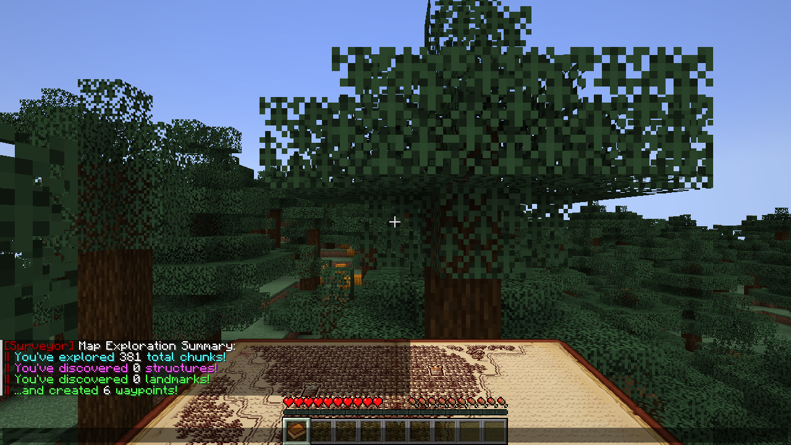

# Surveyor Map Framework — NeoForge

> [!IMPORTANT]
> **This is an unofficial fork.** It is a NeoForge port of [Surveyor Map Framework](https://github.com/sisby-folk/surveyor) by **Sisby folk** ([Modrinth](https://modrinth.com/mod/surveyor)), maintained separately and not affiliated with the original authors. All credit for the mod goes to them. Please report problems with this version [here](https://github.com/Darkona/surveyor-neoforge/issues), not to the original project.

**Surveyor records the world you explore and shares it — map mods draw it.**

Surveyor is the shared backend behind cooperative map mods such as [Antique Atlas](https://github.com/Darkona/antique-atlas-neoforge). It remembers which terrain you have explored, which structures you have found and every waypoint you or your friends placed, keeps it in your save, and syncs it between players on a server. A map mod only has to draw it.

Surveyor has no map screen of its own: install it together with a map mod that uses it.

*Antique Atlas drawing the terrain, waypoints and players Surveyor recorded.*

Minecraft **1.21.1**, **NeoForge 21.1**. Runs natively — no Sinytra Connector or Fabric API needed.

## What it does

**For players**
- Records explored terrain as you move: a summary of the ground, water and biomes of every chunk you have seen.
- Records structures once you have stood in them or looked at them.
- Keeps waypoints: your own, your friends', and server-wide landmarks such as spawn or shops.
- Adds automatic waypoints for nether portals, lodestones and the places you died.
- Lets you switch map mods at any time without losing anything — the data belongs to Surveyor, not to the map.
- Imports your existing waypoints from a Xaero's Minimap save.

**On a server**
- Exploration and waypoints are **cooperative**: by default everyone shares one map. Or split players into groups.
- See your friends on the map, even far away or in another dimension.
- Change computers or reinstall: your map comes back from the server.
- Operators can place server-wide landmarks for everyone.
- Copy exploration into and out of vanilla maps: sneak and use a filled map on a cartography table.

*`/surveyor` shows how much of the world you have mapped.*

## Installation

1. Install NeoForge 21.1 for Minecraft 1.21.1.
2. Put the Surveyor jar in `mods/` — on the **server and every client** for multiplayer, just your game for singleplayer.
3. Add a map mod that uses Surveyor, e.g. [Antique Atlas](https://github.com/Darkona/antique-atlas-neoforge).

**Public server?** Set `globalSharing = false` in `config/surveyor.toml` so players share maps in groups instead of all together.

## Documentation

Everything else is in the [wiki](https://github.com/Darkona/surveyor-neoforge/wiki): [installation](https://github.com/Darkona/surveyor-neoforge/wiki/Installation) · [playing together](https://github.com/Darkona/surveyor-neoforge/wiki/Playing-Together) · [commands](https://github.com/Darkona/surveyor-neoforge/wiki/Commands) · [configuration](https://github.com/Darkona/surveyor-neoforge/wiki/Configuration) · [vanilla maps](https://github.com/Darkona/surveyor-neoforge/wiki/Vanilla-Maps) · [data and troubleshooting](https://github.com/Darkona/surveyor-neoforge/wiki/Data-and-Troubleshooting) · [frontend development](https://github.com/Darkona/surveyor-neoforge/wiki/Frontend-Development)

## Differences from the original

This fork keeps Surveyor's features, mod id, save format and network format, so existing map data and addons such as Antique Atlas keep working. What changed:

**Platform**
- Runs natively on NeoForge 21.1 — no Sinytra Connector or Fabric API. It replaces the original's Connector build; don't install both.
- The configuration file uses NeoForge's format. The `recordIcons` table became the `disabledRecordIcons` list (icons not listed are recorded, as before).
- The mod list's Config button opens a config screen with every option.

**Fixes** — bugs of the original, fixed here. Each fix's commit references the original issue number where there is one.
- Saving can no longer lose map data: a server stopping right after an autosave, a crash in the middle of writing a file, or two saves of the same file overlapping each used to be able to drop or corrupt a region.
- Singleplayer is safe from races between the game and its built-in server, which could crash the game or drop freshly recorded chunks.
- Friends are no longer shown as offline after every autosave.
- Chunks you visit are recorded as explored even when the terrain system is turned off (setups that only use waypoints).
- Map mods are always notified on the game's own thread, so every addon is safe in singleplayer.
- A region's terrain is only unloaded once all of its chunks are. Before, only a quarter of the region was checked, so a region could be saved and dropped while you were still in it, then read back from disk.
- A rare case where saving a region scrambled part of its terrain data (a value above 32767 overwrote its neighbour) is fixed.
- Dying to a named, enchanted weapon no longer crashes the server or the client, and a landmark that can't be read or written is skipped and logged instead of failing the whole save or packet.
- Biomes a mod doesn't register, ids past the registry size, and datapack dimensions with an inline dimension type no longer crash the chunk scan. Dimensions of a different height than the previous one in the same session are recorded again.
- Structures missing from the registry, and mods that place structures through their own world-generation level, no longer crash the server or world generation.
- A connection without Surveyor data, such as a ReplayMod playback, no longer crashes the client, and a player is no longer disconnected when the server has a dimension their client didn't list at login.
- Joining or leaving a share group drops the old group's explored areas and structures instead of leaving them on the map.
- A landmark saved as both present and removed is no longer deleted from the clients that know it, and removing landmarks while the landmark system is frozen no longer throws.
- Singleplayer map mods can read landmarks and terrain palettes while the built-in server changes them without crashing.
- Maps of servers behind a proxy that share a seed no longer overwrite each other: the server sends a world id and the client keeps each server's map in its own folder, copied once from the old seed folder. Servers or clients without it keep the seed folder.

**New features**
- Lodestones and other POIs placed by world generation no longer make the server finish generating their chunk on the spot (stalls, worse with C2ME); their landmark is added once the chunk has loaded. Option `builtins.poiLandmarksFromWorldgen` skips them entirely.
- Players in spectator mode or with invisibility no longer show up on other players' maps; they keep their last visible position. Option `networking.hideHiddenPlayers`.

**For map mods**
- New client event `ExplorationReset`, fired when the player's share group changes and the shared exploration is replaced, so a map can drop areas the new group hasn't explored.

**Performance**
- Recording a chunk no longer creates objects for every block it scans.
- Map data is only packed for sending when a player will actually receive it — no more work per chunk on servers with a single player.
- Player positions are only sent when someone moves or turns, instead of every tick for every player.
- The raycast that discovers structures you look at only runs when your view changes.
- Asking for a group's shared map no longer copies every member's exploration.
- Checking whether a region can be unloaded, done every time a chunk unloads, no longer creates hundreds of objects.
- Working out who receives a sent chunk no longer builds sets of players for every chunk.
- Loaded chunks are recorded on a background thread instead of the server thread, with the same result; option `asyncChunkSummaries`.
- Structure regions are read when needed and dropped from memory when none of their chunks is loaded, instead of all staying in memory from startup.

## Credits and license

Surveyor Map Framework is by **Sisby folk**, with contributions by Ampflower, falkreon, jaskarth and Garden System — original project: [sisby-folk/surveyor](https://github.com/sisby-folk/surveyor). This repository is an unofficial NeoForge fork of it.

Licensed under the **GNU LGPL v3.0 or later** — see [LICENSE](LICENSE). Addons adapted from Surveyor should use a compatible license.
