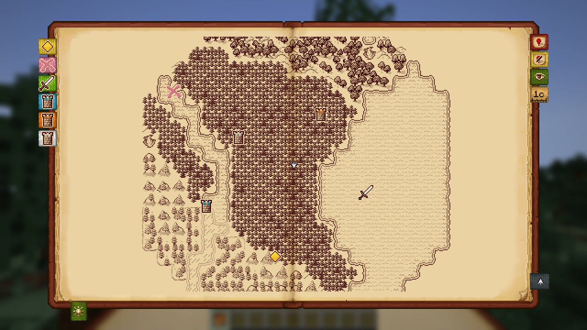

# Surveyor Map Framework

Surveyor records the world you explore: terrain, structures and waypoints. It keeps them with your save and shares them between the players on a server. Map mods such as [Antique Atlas](https://github.com/Darkona/antique-atlas-neoforge/wiki) draw them. Surveyor has no map screen.

## Players and server owners

- [Installation](Installation): what goes where, and compatibility.
- [Playing Together](Playing-Together): shared maps, groups, and how to see your friends.
- [Commands](Commands): every command, and who can use it.
- [Configuration](Configuration): every option in `surveyor.toml`.
- [Vanilla Maps](Vanilla-Maps): how to copy exploration into paper maps and out of them.
- [Data and Troubleshooting](Data-and-Troubleshooting): where Surveyor saves its data, and what to do when something goes wrong.

## Mod developers

- [Frontend Development](Frontend-Development): how the data is organised, for map mods and addons.
